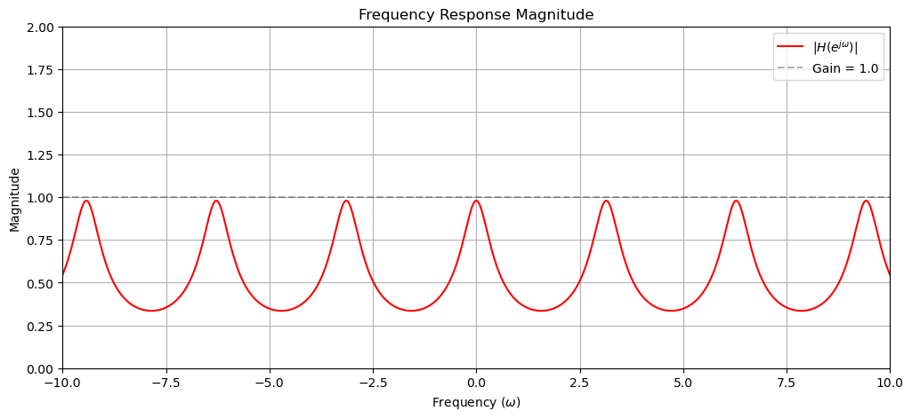
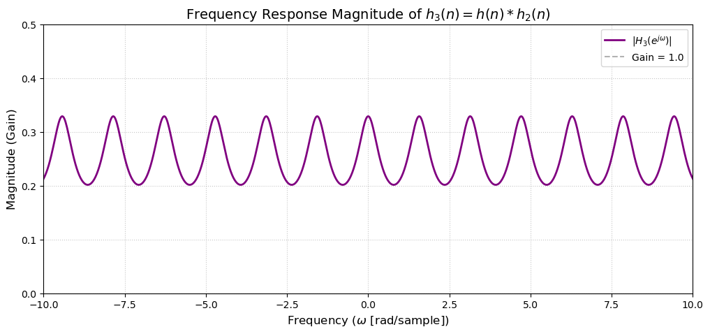
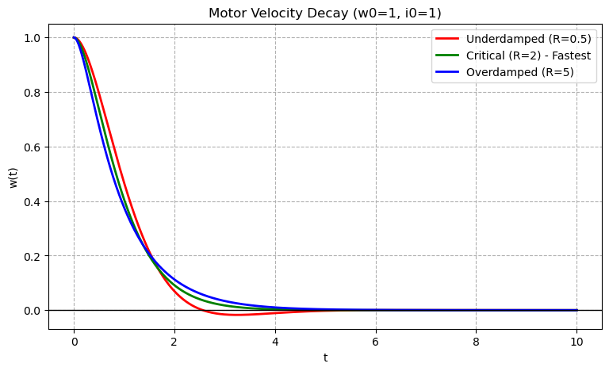
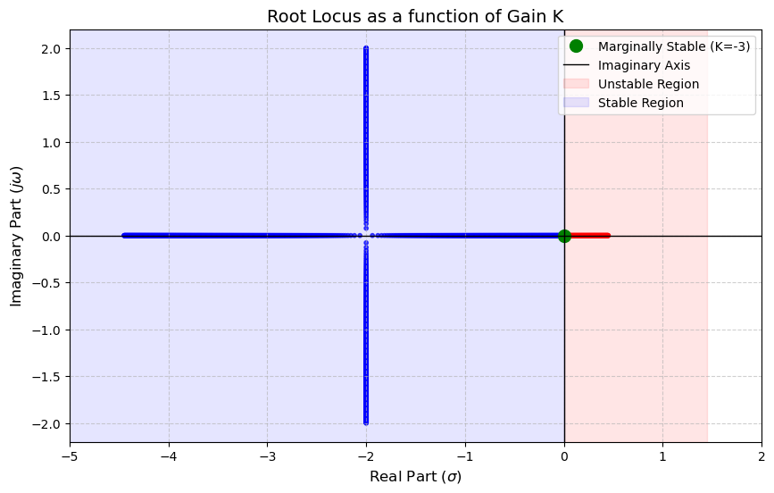

# Linear Systems: Analysis of LTI Systems in Python

Analytical and numerical analysis of three linear time-invariant (LTI) systems: a discrete-time filter, a DC motor, and a feedback control loop. Every result is first derived by hand (Z-transform, Laplace transform, partial fractions) and then verified in Python with symbolic math, numerical simulation and plots.

Course project for the **Linear Systems** course at Bar-Ilan University, Faculty of Engineering. Grade: **100**.

## What is inside

The notebook `Linear_Systems_LTI_Analysis.ipynb` contains three problems. Each section shows the derivation, the code that checks it, a plot, and a short interpretation of the plot.

### 1. Discrete-time filter (Z-transform)

System: $y(n) - a^2y(n-2) = 0.5x(n)$

- Transfer function $H(z)$, poles and the stability condition $|a| < 1$
- Impulse response $h(n)$, derived with partial fractions and checked by running the difference equation recursively
- Frequency response and filter type, including the effect of modulating $h(n)$ by $(-1)^n$ and by $e^{j\pi n/2}$
- A cascade of the modulated filters that forms a comb filter
- A cascade of $M$ blocks that exactly cancels a delayed echo in the input





### 2. DC motor (differential equations and Laplace transform)

- Reducing the coupled current/speed equations to a single second-order ODE (done by hand and with SymPy)
- Laplace transform of the motor speed with initial conditions
- Poles as a function of the resistance $R$: underdamped, critically damped and overdamped cases
- The resistance that gives the fastest decay without oscillation ($R = 2$)
- Closed-form speed $w(t)$ for a short circuit ($R = 0$) and an open circuit ($R \to \infty$)



### 3. Feedback control system

- Transfer function of two cascaded blocks, pole-zero map and Bode magnitude plot
- Closed-loop transfer function $T(s)$, region of convergence and BIBO stability
- Step response and impulse response, derived with partial fractions and inverse Laplace transform
- Stability range of a feedback gain $K$ ($K > -3$), shown with a root-locus style plot



## Tools

Python, NumPy, SciPy (`scipy.signal`), SymPy, Matplotlib, Jupyter.

## How to run

```bash
pip install -r requirements.txt
jupyter notebook Linear_Systems_LTI_Analysis.ipynb
```

## Author

Roee Amsalem, B.Sc. student in Data Engineering and Artificial Intelligence, Bar-Ilan University.
